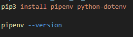
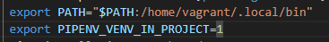
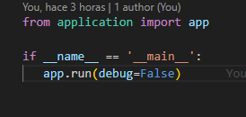

# despliegue_flask-gunicorn

## Propósito del Proyecto
Proyecto para la asignatura Despliegue de Aplicaciones Web en el cual realizaremos un despliegue con Python,Flask y Gunicorn. Todo ello realizado en una Máquina Virtual con Vagrant y VirtualBox

## Índice

1. [Herramientas necesarias](#herramientas-necesarias)
2. [Comandos utilizados](#comandos-utilizados-en-el-proyecto)
   - [Comandos de Vagrant (Terminal local)](#comandos-de-vagrant-terminal-local)
   - [Comandos de Linux (Terminal remota)](#comandos-de-linux-terminal-remota)
   - [Comandos para verificación](#comandos-para-verificación)
3. [Ejecución del proyecto](#ejecución-del-proyecto)

---

## Herramientas necesarias

-  **IDE**: En mi caso, Visual Studio Code.
- **Vagrant**
- **VirtualBox**

### Herramientas Internas 
- **Python**
- **Flask**
- **Gunicorn**
> **Consejo:** No es obligatorio, pero se recomienda usar un sistema de control de versiones. En mi caso utilicé **Git** y **GitHub** para gestionar el proyecto.

---


## 1. Instalación y configuración del proyecto.
Para comenzar con este proyecto, deberemos crear una máquina virtual con **Vagrant**.

> **OJO** : En este proyecto tenemos que crear 2 archivos de provisionamiento, uno para el root y otro para el usuario, que será de tipo INLINE con privileged: false. (en mi caso, vagrant).
> Esto se debe a que si instalamos las dependencias de python en la raiz, puede afectar a archivos del sistema y corromperlos.

Una vez que tengamos esto claro, deberemos instalar los paquetes necesarios como root:


Una vez instalado el paquete de python y pip, podemos utilizar este gestor de dependencias en el usuario :



Utilizamos el comando --version para comprobar que se ha instalado correctamente.

Los plugins instalados serán pipenv, para gestionar entornos virtuales y python-dotenv para gestionar las variables de entorno.

### 1.2 Variables de Entorno.

Posteriormente crearemos las siguientes variables de Entorno:



La primera será para definir la ruta que tendrá que usar en el pipenv, la segunda variable vemos su uso más adelante, con Gunicorn.

#### 1.2.1 Creación de Espacio de Trabajo

Para crear e indicar la carpeta donde crearemos el proyecto simplemente añadimos estas lineas en el archivo de provisionamiento flask.sh:

```bash
    mkdir -p /var/www/app
    chown -R vagrant:www-data /var/www/app
    chmod -R 775 /var/www/app
```

#### 1.2.2 Variables de Python y su ejecución
Otras variables que necesitaremos para indicar cuál es el archivo .py de la aplicación y el entorno, que en nuestro caso será producción:

```bash
   cd /var/www/app
   echo "FLASK_APP=wsgi.py" > .env
   echo "FLASK_ENV=production" >> .env
```

### 1.3 Instalacíon de paquetes de python (Flask y Gunicorn)

Para instalar estos paquetes, si fuera de manera interactiva, deberíamos acceder a la shell de pipenv con **pipenv shell**, pero al querer todo automatizado, utilizaremos la siguiente alternativa que no requiere actividad del usuario:

```bash
   pipenv install flask gunicorn
```

## 2. Archivos .py y despliegue

Para implementar dichos archivos ( que es,en ensencia, nuestro proyecto) primero los he copiado a mi repositorio (application.py y wsgi.py) para posteriormente copiarlos a la máquina virtual. 

Su contenido es el siguiente:




Para copiarlos a nuestro proyecto, desde el usuario, utilizaremos las siguientes instrucciones :

```bash
   cp /vagrant/application.py ./
   cp /vagrant/wsgi.py ./
```


