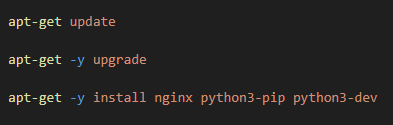
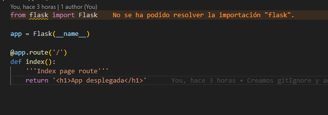
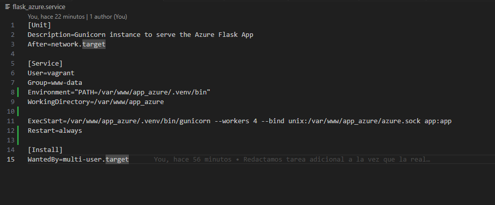
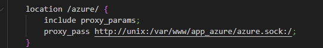
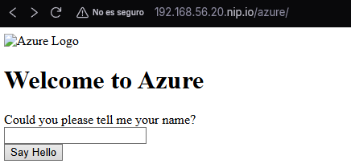

# despliegue_flask-gunicorn

## Propósito del Proyecto
Proyecto para la asignatura Despliegue de Aplicaciones Web en el cual realizaremos un despliegue con Python,Flask y Gunicorn. Todo ello realizado en una Máquina Virtual con Vagrant y VirtualBox

## Índice

1. [Herramientas necesarias](#herramientas-necesarias)
   - [Herramientas Internas](#herramientas-internas)
2. [1. Instalación y configuración del proyecto](#1-instalación-y-configuración-del-proyecto)
   - [1.2 Variables de Entorno](#12-variables-de-entorno)
     - [1.2.1 Creación de Espacio de Trabajo](#121-creación-de-espacio-de-trabajo)
     - [1.2.2 Variables de Python y su ejecución](#122-variables-de-python-y-su-ejecución)
   - [1.3 Instalación de paquetes de python (Flask y Gunicorn)](#13-instalacíon-de-paquetes-de-python-flask-y-gunicorn)
3. [2. Archivos .py y despliegue](#2-archivos-py-y-despliegue)
4. [3. Despliegue](#3-despliegue)
   - [3.1 Despliegue con pipenv](#31-despliegue-con-pipenv)
   - [3.2 Despliegue con Gunicorn](#32-despliegue-con-gunicorn)
   - [3.3 Despliegue con Nginx + Gunicorn](#33-despliegue-con-nginx--gunicorn)
5. [4. Tarea Adicional (Proyecto Azure)](#4-tarea-adicional)

---

## Herramientas necesarias

-  **IDE**: En mi caso, Visual Studio Code.
- **Vagrant**
- **VirtualBox**

### Herramientas Internas 
- **Python**
- **Flask**
- **Gunicorn**
> **Consejo:** No es obligatorio, pero se recomienda usar un sistema de control de versiones. En mi caso utilicé **Git** y **GitHub** para gestionar el proyecto.

---


## 1. Instalación y configuración del proyecto.
Para comenzar con este proyecto, deberemos crear una máquina virtual con **Vagrant**.

> **OJO** : En este proyecto tenemos que crear 2 archivos de provisionamiento, uno para el root y otro para el usuario, que será de tipo INLINE con privileged: false. (en mi caso, vagrant).
> Esto se debe a que si instalamos las dependencias de python en la raiz, puede afectar a archivos del sistema y corromperlos.

Una vez que tengamos esto claro, deberemos instalar los paquetes necesarios como root:



Una vez instalado el paquete de python y pip, podemos utilizar este gestor de dependencias en el usuario :


Utilizamos el comando --version para comprobar que se ha instalado correctamente.

Los plugins instalados serán pipenv, para gestionar entornos virtuales y python-dotenv para gestionar las variables de entorno.

### 1.2 Variables de Entorno.

Posteriormente crearemos las siguientes variables de Entorno:


La primera será para definir la ruta que tendrá que usar en el pipenv, la segunda variable vemos su uso más adelante, con Gunicorn.

#### 1.2.1 Creación de Espacio de Trabajo

Para crear e indicar la carpeta donde crearemos el proyecto simplemente añadimos estas lineas en el archivo de provisionamiento flask.sh:

```bash
    mkdir -p /var/www/app
    chown -R vagrant:www-data /var/www/app
    chmod -R 775 /var/www/app
```

#### 1.2.2 Variables de Python y su ejecución
Otras variables que necesitaremos para indicar cuál es el archivo .py de la aplicación y el entorno, que en nuestro caso será producción:

```bash
   cd /var/www/app
   echo "FLASK_APP=wsgi.py" > .env
   echo "FLASK_ENV=production" >> .env
```

### 1.3 Instalacíon de paquetes de python (Flask y Gunicorn)

Para instalar estos paquetes, si fuera de manera interactiva, deberíamos acceder a la shell de pipenv con **pipenv shell**, pero al querer todo automatizado, utilizaremos la siguiente alternativa que no requiere actividad del usuario:

```bash
   pipenv install flask gunicorn
```

## 2. Archivos .py y despliegue

Para implementar dichos archivos ( que es,en ensencia, nuestro proyecto) primero los he copiado a mi repositorio (application.py y wsgi.py) para posteriormente copiarlos a la máquina virtual. 

Su contenido es el siguiente:




Para copiarlos a nuestro proyecto, desde el usuario, utilizaremos las siguientes instrucciones :

```bash
   cp /vagrant/application.py ./
   cp /vagrant/wsgi.py ./
```

## 3. Despliegue

Para desplegar el proyecto encontramos 3 maneras diferentes:

- Con el propio pipenv 
- Con Gunicorn
- Con Nginx, que internamente tiene conectado Gunicorn

### 3.1 Despliegue con pipenv.

La manera más sencilla de todas, simplemente haremos **vagrant ssh** y dentro ejecutaremos el siguiente comando:

```bash
   pipenv run flask run --host '0.0.0.0'
```

Ahora entraremos a la siguiente dirección url (http://192.168.56.20.nip.io:5000/) y veremos lo siguiente si todo ha ido bien :


> **OJO** : He intentado utilizar esta forma de manera automática utilizando esta instrucción en segundo plano con '&', no he tenido éxito, pero lo he dejado comentado por si acaso, pues bloqueaba la terminal. Así se explica el porqué lo he hecho a través del ssh.

### 3.2 Despliegue con Gunicorn

Para desplegar nuestro proyecto con Gunicorn deberemos añadir la siguiente linea a la provisión :

```bash
   pipenv run gunicorn --workers 4 --bind 0.0.0.0:5000 wsgi:app --daemon
```

Obtendremos la misma salida que en la anterior foto,visitando la misma url.Gunicorn tiene varias ventajas respecto de pipenv, entre ellas el poder tener más de un "worker" que hará que si un hilo falla, podremos seguir usando los siguientes.

Además al ponerlo en modo demonio ( --daemon ) podremos liberar la terminal y desvincular el proceso, lo que es bastante idoneo para un archivo de provisionamiento de Vagrant.

### 3.3 Despliegue con Nginx + Gunicorn

Primero deberemos instalar nginx. Al haberlo instalado en la foto número 1, no tendriamos que hacer este paso.

Lo siguiente será configurar nuestro sitio web, esto lo haremos con el archivo app.conf, que debe quedar así :


Posteriormente, a traves del root, deberemos activar nuestro sitio web y pasarle esta configuración previamente hecha :

```bash
   cp /vagrant/app.conf /etc/nginx/sites-available/app.conf
   ln -sf /etc/nginx/sites-available/app.conf /etc/nginx/sites-enabled/
   rm -f /etc/nginx/sites-enabled/default
   systemctl enable nginx
```

En este momento ya tendríamos nginx corriendo con normalidad, pero falta enlazarlo con Gunicorn.

Comenzando dicho enlace, deberemos crear un archivo para que systemd ejecute Gunicorn como un servicio más :


Habilitaremos el servicio y le diremos a systemd que hemos realizado cambios :

```bash
   sudo systemctl daemon-reload
   systemctl enable flask_app
   systemctl start flask_app
```

Y ahora nos preguntaremos, ¿Qué es .venv y porque lo usamos tanto como variable como en la configuración del servicio Gunicorn?

Pues bien, .venv es la carpeta donde reside un entorno virtual de python, entonces al ejecutar esta linea como usuario en el entorno de python :

```bash
        export PIPENV_VENV_IN_PROJECT=1
```

Le estamos diciendo que el entorno de trabajo se guarde de manera centralizada y sin hashear, en la carpeta .venv .

Por ello cuando vamos a configurar el servicio de Gunicorn, vemos la siguiente carpeta :

```bash
   ExecStart=/var/www/app/.venv/bin/gunicorn --workers 3 --bind unix:/var/www/app/app.sock wsgi:app
```

Diferente a lo que teníamos antes cuando estaba solo gunicorn,pues esta linea la ejecutabamos tal cual en la provisión y no dentro de un fichero, vemos que la carpeta es .venv y no un número o palabra hasheada, de ahí el uso de esta configuración.

## 4. Tarea Adicional

Para una mejor comprobación de funcionamiento, he decidido ejecutar la aplicación de la Tarea de ampliación en otro puerto diferente, para poder ver las 2 de manera simultanea.

Lo primero será instalar el nuevo proyecto, haciendo los siguientes comandos como usuario (privileged: false) :

```bash
   cd /var/www
   git clone https://github.com/Azure-Samples/msdocs-python-flask-webapp-quickstart app_azure
   cd app_azure
   export PIPENV_VENV_IN_PROJECT=1
```

Repetimos el export de la configuración porque es otro proyecto totalmente diferente al anterior.

Ahora instalamos sus paquete requeridos con estas instrucciones :

```bash
   pipenv install -r requirements.txt
```

Posteriormente, deberemos crear otro archivo de systemd para este nuevo proyecto :



También lo agregamos a la provisión con el siguiente comando :

```bash
   cp /vagrant/flask_azure.service /etc/systemd/system/flask_azure.service
   systemctl enable flask_azure
   systemctl start flask_azure
```

Por si acaso, le damos los permisos correspondientes (He sustituido los de la primer proyecto a más generales, para que engloben a ambos) :

```bash
   chown -R vagrant:www-data /var/www
   chmod -R 775 /var/www
```

Por último, le creamos una ruta nueva llamada /azure en la configuración de nuestro sitio web de nginx :



Nota: Le ponemos esas barras para que nginx detecte que es una ruta independiente, y no se "lie" entre las dos.

Una vez hecho todo esto, nos meteremos a la ruta /azure/ y veremos lo siguiente :


> **OJO:** Debemos instalar git, para que no pase como a mi, que estuve media hora buscando el fallo y era por esta razón....


> **OJO:** Tener cuidado con que nginx despliega en el puerto 8080 (el default) y gunicorn en el 5500, porque si tenemos el despliegue con nginx e intentamos acceder al puerto 5500, no saldrá nada (y perderemos el tiempo como yo hice, buscando el problema....)


